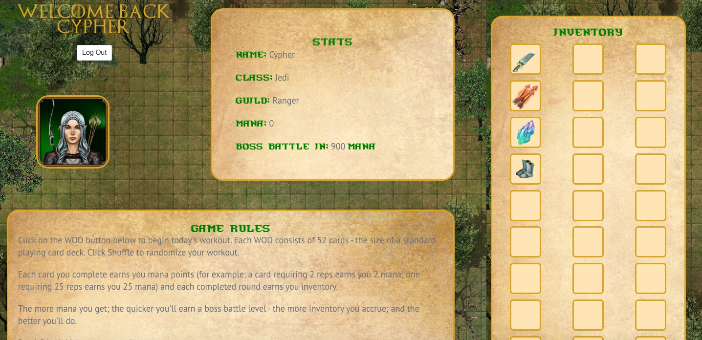

Game of Fitness README
----------------------

### Introduction

Game of Fitness is a card-based workout app created using Ruby on Rails and AngularJS.

#### Log In Information

###### https://floating-everglades-39357.herokuapp.com/
###### username: Cypher
###### password: cypher

#### Screen Shots

#### Wireframes

#### User Story
As a user, I want the ability to create a customized character, and generate really great workouts. I want to have some sort of reward system and I really like old school RPG style games. I want loot - and I want to keep my loot. I also think boss battles are really cool.

#### General Approach
This game came about from a need within a community I am a part of (Nerd Fitness) for the ability to keep track of the merit-style badges I'd been creating for fellow forum members. We wanted loot, a way to store loot, and we also all like to challenge ourselves with hard workouts. Inspired by one of my fellow Nerds' habits of working the group he trains to death using a deck of cards, the idea for this game system was born. Plus, Magic cards and Zelda are cool, so I wanted to incorporate those elements into my game.

#### Hurdles & Unsolved Problems
**Hurdles:** All of them. Apparently, Angular and Rails don't really like to play nicely together. And, setting my cards up as an API + my users up as a "regular" psql database was probably not the best idea, since Rails really doesn't want you to pass things from the back end to the front end in any kind of easy-to-accomplish manner. I *should* have just created relational tables and been done with it, but nooooo, I had to get all fancy (but only halfway fancy).

**Unsolved Problems:** In version 1.5, I would like to add functionality for loot generation and the ability for a user to pick their own avatar. In version 2.0, I want to add boss battles that are earned in X amount of mana points - and I want that boss battle to take place through a Phaser game. In version 3.0, I want to add a PvP feature so users can battle it out amongst themselves before heading off to battle the boss. And in version 4.0, I want users to be able to "level up" their characters with the loot they've earned + the muscle groups they've worked.

### Technologies Used

- Ruby 4  
- AngularJS 1

### Gem Dependencies

- Rails 4.2.6 
- pg 0.15 
- sass-rails 5.0 
- uglifier 1.3.0 
- bulma-rails 0.0.28 
- coffee-rails 4.1.0 
- jquery-rails 
- jbuilder 2.0 
- sdoc 0.4.0 
- bcrypt 3.1.7 
- byebug 
- pry-rails 
- web-console 2.0 
- spring 
- rails_12factor

### Installation

1. Clone the GitHub repository.

2. Navigate to the main page of the repo and click  
   ⋅⋅**Clone or download**

3. Click the clipboard to copy the clone URL for the repository.

4. Open your CLI.

5. Cd into the location you want the cloned directory to live.

   ⋅⋅ `git clone` and paste the URL you have on the clipboard.
   Hit Enter.

6. To install the database:

   ⋅⋅ run `rake db:migrate`

   ⋅⋅ run `rake db:seed`

### Support

Users looking for support should file an issue on the [GitHub issue tracking page] (https://github.com/cochrancj/Game_Of_Fitness/issues/7 "Git Issue Tracking Page"), **or** [create a pull request] (https://github.com/cochrancj/Game_Of_Fitness/pulls "Create A Pull Request") if you have a fix you would like incorporated.
